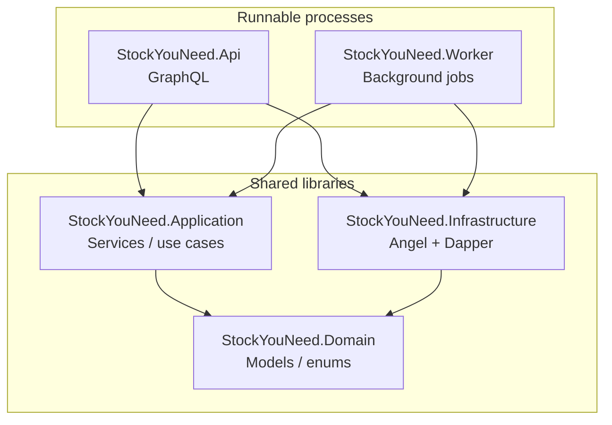
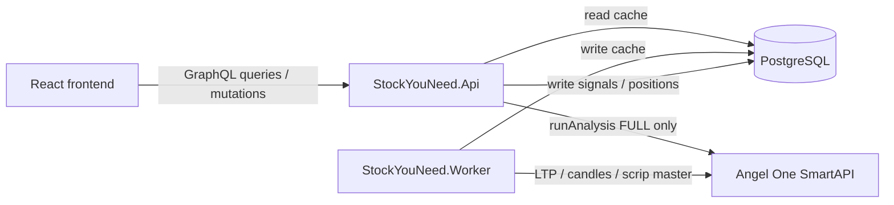
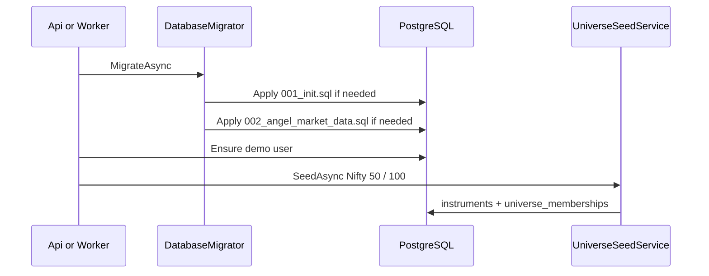
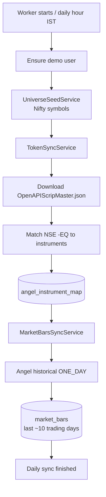
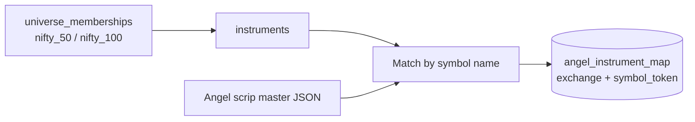
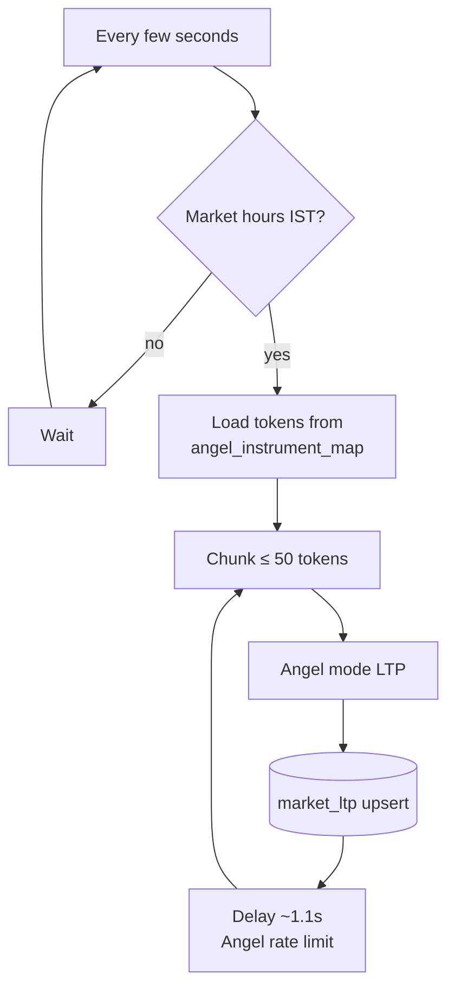
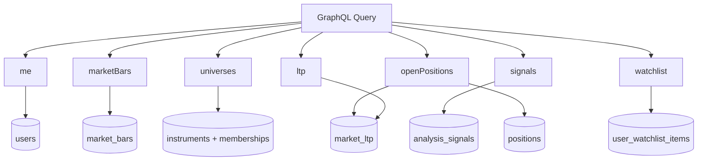
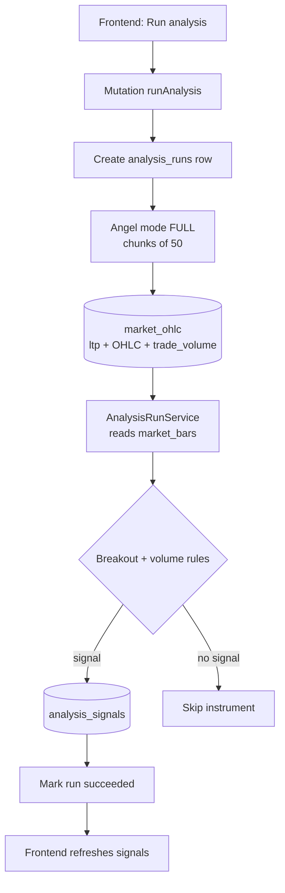
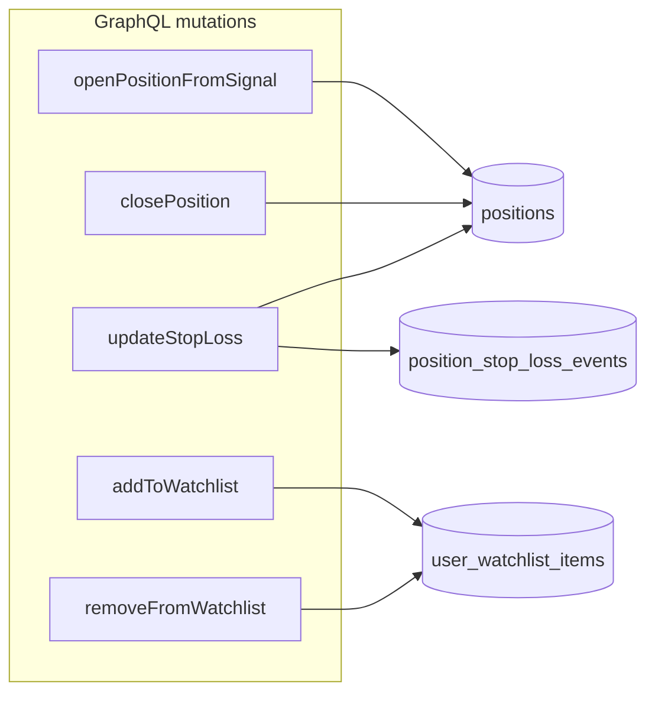
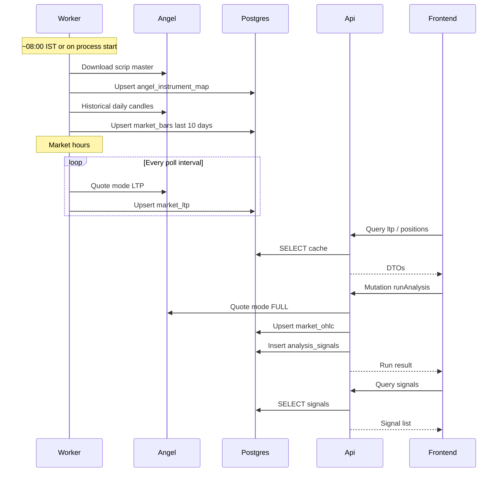

# StockYouNeed — Backend flow

This document describes how the .NET backend is structured and how data moves through **Worker**, **Api**, **Postgres**, and **Angel One SmartAPI**.

Related code:

- [`backend/src/StockYouNeed.Worker`](../backend/src/StockYouNeed.Worker) — background sync
- [`backend/src/StockYouNeed.Api`](../backend/src/StockYouNeed.Api) — GraphQL for the frontend
- [`backend/src/StockYouNeed.Application`](../backend/src/StockYouNeed.Application) — use cases
- [`backend/src/StockYouNeed.Infrastructure`](../backend/src/StockYouNeed.Infrastructure) — Angel client + Postgres
- [`database/001_init.sql`](../database/001_init.sql) / [`database/002_angel_market_data.sql`](../database/002_angel_market_data.sql)

---

## 1. Solution layout

Two runnable processes share the same domain/application/infrastructure libraries.



| Project | Role |
|--------|------|
| **Api** | Serves React; reads Postgres; `runAnalysis` may call Angel FULL |
| **Worker** | Daily token sync, 10-day bars, market-hours LTP poll |
| **Application** | `TokenSyncService`, `MarketBarsSyncService`, `LtpPollService`, `AnalysisRunService` |
| **Domain** | DTOs / row models |
| **Infrastructure** | `AngelMarketDataClient`, repositories, SQL migrator |

**Why Api ≠ Worker:** long Angel syncs must not block user GraphQL requests. ~100 users share one market cache in Postgres.

---

## 2. System overview



**Hard rule:** GraphQL list/read queries never call Angel. Users always hit the shared DB cache.

---

## 3. Startup sequence

Runs when **Api** or **Worker** starts.



---

## 4. Worker — daily sync pipeline

`DailySyncHostedService` runs shortly after start, then again around **08:00 IST** (configurable).



### Token sync detail



Quote / history APIs need Angel **tokens**, not app UUIDs. The map is the bridge.

---

## 5. Worker — LTP poll (market hours)

`LtpPollHostedService` loops during NSE cash hours (approx 09:00–15:35 IST, weekdays).



Frontend / positions MTM read **`market_ltp` only** — never Angel per user.

---

## 6. Api — read path (queries)

All of these hit Postgres only.



`openPositions` also refreshes marks from `market_ltp` before returning.

---

## 7. Api — Run analysis path (mutation)

Triggered when the user clicks **Run** in the UI (`runAnalysis`).



**Why FULL on Run?** Angel OHLC mode has no volume; FULL provides `tradeVolume`. Depth is still ignored (tables reserved for later).

---

## 8. Position / watchlist actions



No Angel order placement yet — this is the paper book. Live execution can reuse the same Angel client later.

---

## 9. End-to-end timeline (typical day)



---

## 10. Table ownership cheat sheet

| Table | Written by | Read by |
|-------|------------|---------|
| `instruments` / `universe_memberships` | Seed (Worker/Api start) | Worker + Api |
| `angel_instrument_map` | Worker token sync | Worker LTP/bars; Api Run |
| `market_bars` | Worker daily bars | Analysis engine |
| `market_ltp` | Worker LTP poll | Api queries / MTM |
| `market_ohlc` | Api `runAnalysis` | Debugging / future UI |
| `analysis_runs` / `analysis_signals` | Api analysis | Frontend |
| `positions` / watchlist | Api mutations | Frontend |

Reserved / unused for now: `market_quotes_full`, `market_quote_depth`.

---

## 11. Config knobs

See `appsettings.json` on Api and Worker:

| Section | Purpose |
|---------|---------|
| `Database:ConnectionString` | Postgres |
| `Angel:Enabled` | Gate live Angel calls |
| `Angel:ApiKey` / `ClientCode` / `Password` / `TotpSecret` | SmartAPI login |
| `WorkerSchedule:DailySyncHourIst` | Daily pipeline hour |
| `WorkerSchedule:LtpPollIntervalSeconds` | LTP loop cadence |
| `WorkerSchedule:MarketBarsLookbackDays` | History window (default 10) |
| `DevAuth:DemoUserId` | Temporary tenancy until real auth |

---

## 12. Mental model

```text
Worker fills the cache  →  Api serves the cache  →  Run refreshes OHLC+volume & writes signals
Frontend only displays data and fires mutations
```
