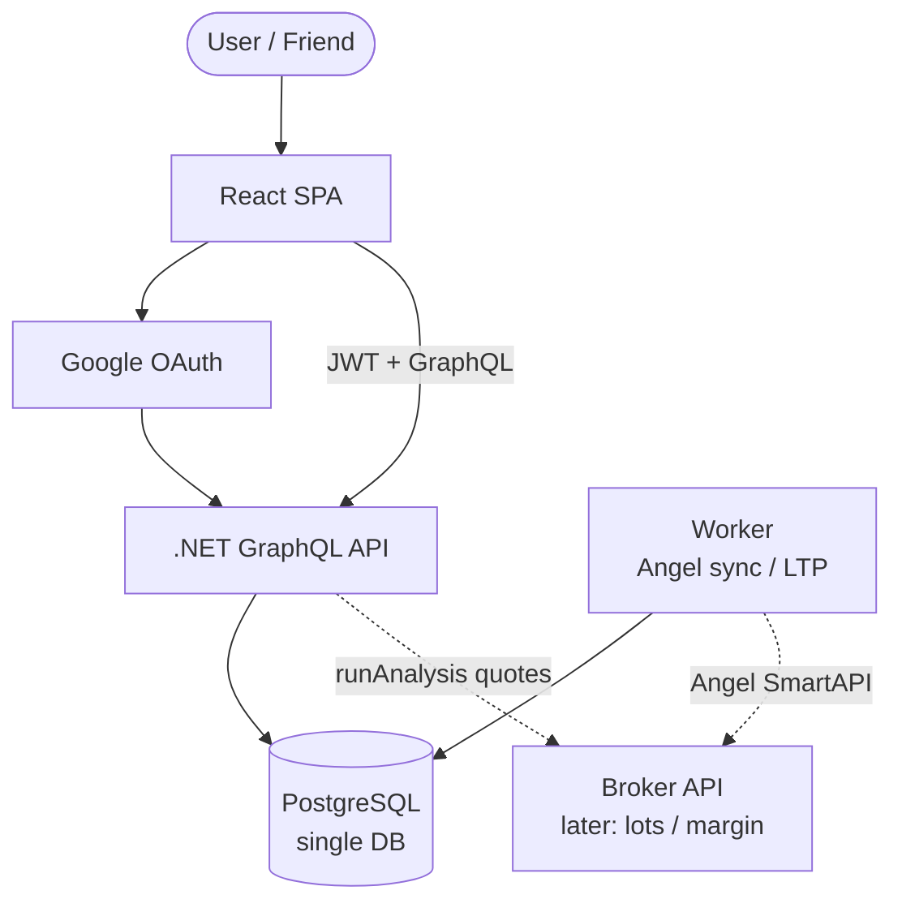
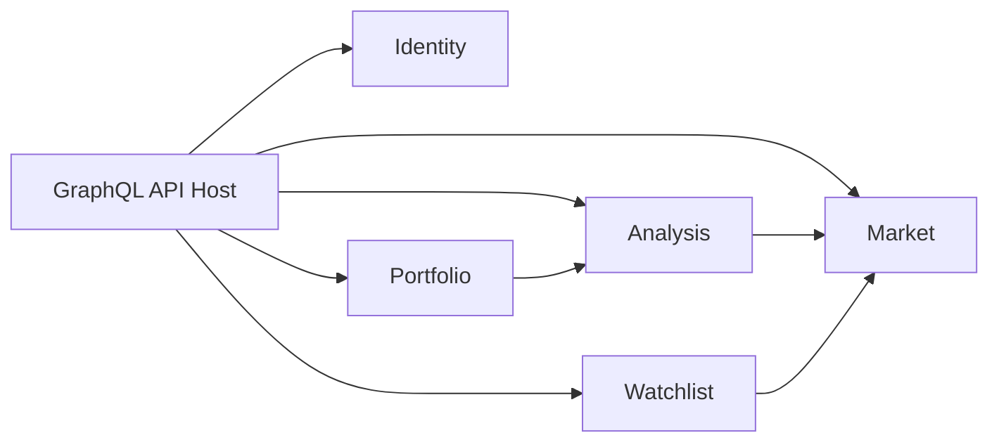
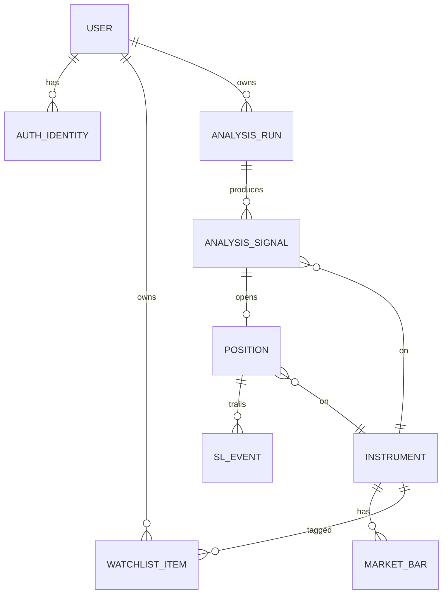
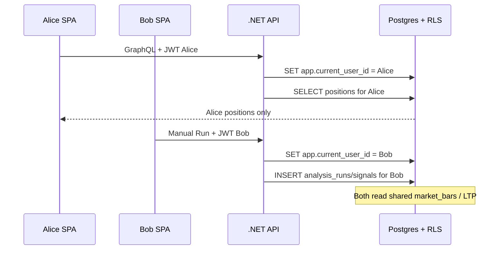

# StockYouNeed — Interview system design guide

Use this when an interviewer asks: *“Design a multi-user stock screener / paper-trading app”* or *“Walk me through your project architecture.”*

Related docs:

- [BACKEND_FLOW.md](./BACKEND_FLOW.md) — how Worker / Api / Angel actually run
- [`database/001_init.sql`](../database/001_init.sql) — schema + RLS
- README — how to run locally

---

## One-liner (memorize this)

> Multi-tenant trading SaaS as a **modular monolith**: shared market master data, tenant-owned portfolio/analysis rows, JWT + RLS for isolation, immutable signals and event-sourced trailing stops; extract Worker/Analysis only when a real scale or ownership boundary appears — not on day one.

---

## How to answer (8–10 min cadence)

### Step 1 — Clarify (≈1 min)

Say out loud:

> Paper trading screener for Indian F&O, multi-user, Google auth. Recommendations from OHLC rules; positions/P&L tracked in-app; real fills on the broker manually. Scale: tens of users first, not millions.

Ask if needed:

- Real-time intraday vs end-of-day?
- Paper only vs live broker orders?
- Multi-tenant SaaS or single shared account?

### Step 2 — Requirements (≈1 min)

| Functional | Non-functional |
|------------|----------------|
| Screen Nifty 50 / 100 + watchlist | Multi-tenant isolation |
| Buy / Sell signals, SL, T1–T3 | Auth (Google / Gmail) |
| Positions, history, P&L | Replayable analysis (cached bars) |
| First-open-of-day + Manual Run | Simple ops (personal + friends) |
| Futures lot / margin / estimated P&L | Broker wired later for exact margin |

### Step 3 — High-level design (≈2 min)

Draw **SPA → API → Postgres**, plus a **Worker** for market sync.

> I’d start with a **modular monolith** (one GraphQL API + one Worker process + one Postgres). Clear domains — Identity, Market, Analysis, Portfolio, Watchlist — not a fleet of microservices on day one. We don’t yet have independent scale or team ownership. Boundaries stay extractable later.

That sentence alone sounds senior.

### Step 4 — Data model (≈2 min)

Explain **two scopes**:

| Scope | Examples | Who sees it |
|-------|----------|-------------|
| **Shared** | instruments, index membership, OHLCV / LTP cache, futures lots | All users |
| **Tenant** | watchlist, analysis runs/signals, positions, SL events | Only that `user_id` |

Key patterns:

- **Signals are immutable snapshots** (entry, SL, T1–T3, rule evidence).
- **Positions are mutable**; trailing SL is **append-only events** (never lose audit history; SL never widens).

### Step 5 — Multi-tenancy (≈2 min) — interviewers love this

> Same database does **not** mean same private data. Every tenant table has `user_id`. The app filters by JWT user. Postgres **RLS** sets `app.current_user_id` per request so a buggy query still can’t leak Friend B’s positions. Market data is shared on purpose so we don’t duplicate RELIANCE bars per user.

Defense in depth:

1. JWT / session after Google login  
2. Application: every resolver uses `user_id = currentUser`  
3. Postgres RLS on tenant tables  
4. Schema shape: no accidental cross-tenant ownership  

### Step 6 — Hot path (≈1–2 min)

1. Login → JWT  
2. First open today → one auto analysis run (per user / IST date)  
3. Ensure last ~10 trading bars (+ sectors) in cache  
4. Rules engine → buy/sell signals (SL + MA targets)  
5. UI shows Buy / Downtrend-Sell + lot / margin / P&L estimate  
6. Click Buy → open paper position (user fills on broker manually)  
7. Later days → trail SL only in favorable direction; log event  
8. Manual Run anytime → new `analysis_runs` for that user only  

### Step 7 — Tradeoffs (must say)

| Choice | Why | Tradeoff |
|--------|-----|----------|
| Modular monolith (+ Worker) | Fast ship, easy debug | Later split if analysis blocks API |
| One Postgres | Simple for &lt;100 users | Vertical scale first |
| Shared market cache | One Angel sync serves all users | Stale if ingest fails — need refresh / health |
| Broker later | Ship core UX | Margin approximate until API wired |
| Paper book | No order risk for friends | Not a full broker clone |

### Step 8 — If they push microservices

> I’d extract **Market ingest** or **Analysis worker** only when the API is blocked by long scans or we need independent deploy/scale — not as the starting topology. We already separate Worker from Api as processes sharing libraries; that’s the first natural split.

---

## UML diagrams (whiteboard-ready)

### 1) System context

### 2) Internal modules (package diagram)

### 3) Domain / ER

### 4) Multi-tenant sequence

### 5) Example rows (same tables, different owners)

| Table | Row | user_id | Visible to |
|-------|-----|---------|------------|
| `market_bars` | RELIANCE OHLCV | — (shared) | Alice + Bob |
| `positions` | Buy RELIANCE · open | Alice | Alice only |
| `positions` | Sell TCS · open | Bob | Bob only |
| `analysis_signals` | INFY buy · T1/T2/T3 | Bob | Bob only |
| `user_watchlist_items` | Favourite: HDFCBANK | Alice | Alice only |

---

## Strategy rules (product → design talking points)

### Buy

- Price &gt; last 2 sessions’ high  
- Volume ≥ last 3 days (momentum; “not too low”)  
- Sector index also breaks last 2-day high (**no** volume check for sector)  
- SL = last 2-day low → **trail up only** (never widen)  
- T1–T3 = 2/3/5 DMA **above** entry, ascending  

### Sell (inverse)

- Price &lt; last 2 sessions’ low  
- Volume momentum still required  
- Sector confirms breakdown  
- SL = last 2-day high → **trail down only**  
- Targets = MAs **below** entry (T1 = nearest)

Scan universes: **Nifty 50**, **Nifty 100**, **user watchlist**.

---

## Likely follow-up questions (and strong answers)

### “Why not microservices?”

Personal/friends scale has no independent deploy teams or hot-path scaling. Microservices add distributed transactions, harder local/debug, and delay shipping the buy→position loop. Modular monolith + Worker is the senior choice *for these constraints*.

### “How do you prevent double analysis on first open?”

`user_daily_activity (user_id, activity_date)` — one auto run per IST business day; Manual Run always allowed as a new `analysis_runs` row.

### “How do you version the strategy?”

Store rule evidence on the signal (last_2d high/low, MAs, volume_ok, sector_confirmed). Changing code tomorrow doesn’t rewrite yesterday’s recommendation. Optionally add `strategy_version` on `analysis_runs` later.

### “What if Angel rate-limits?”

Shared cache: Worker syncs once; ~100 users read Postgres, never call Angel per click. Analysis can use FULL quotes carefully; backoff + circuit breaker in Infrastructure.

### “How does trailing SL stay correct under concurrency?”

Update position SL in a transaction; insert `position_stop_loss_events` only when new SL is strictly tighter (buy: higher; sell: lower). App enforces; DB can add CHECK / compare in SQL.

### “How would you scale to 10k users?”

1. Keep shared market cache  
2. Move analysis to a queue/worker per user or batch  
3. Read replicas for GraphQL lists  
4. Still one logical DB until tenancy or region forces shard — don’t invent shards early  

### “Security?”

No plaintext secrets in repo; Angel keys in config/env; RLS; never return other users’ rows; paper trading ≠ order placement until broker OAuth is explicit per user.

---

## What to draw on a whiteboard (checklist)

1. Boxes: React · Api · Worker · Postgres · Google · Broker (dashed)  
2. Label **shared** vs **tenant** data on Postgres  
3. Sequence: login → run → signal → open position → trail SL  
4. Say the one-liner + one tradeoff (monolith vs microservices)

---

## Mapping to this repo

| Interview concept | In this codebase |
|-------------------|------------------|
| Modular monolith | `StockYouNeed.Api` + shared Application/Domain/Infrastructure |
| Market ingest process | `StockYouNeed.Worker` (Angel, bars, LTP) |
| GraphQL read/write | Api mutations: run analysis, open/close positions |
| Schema + RLS | `database/001_init.sql` |
| Thin frontend | React pages; no strategy math, no Angel keys |

Until real auth is wired, Api uses demo user `11111111-1111-1111-1111-111111111111` (header `X-User-Id`) — mention as **current state**, design target is Google OAuth + JWT.
